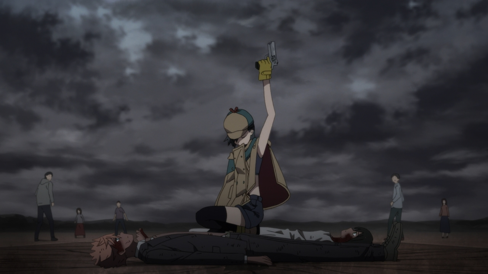


You are either one or two steps away from success, the former expresses competence; the latter—completely mired down where only a forgiving lodestar can offer a chance to escape.


Unfinished article due to site-publish testing, **will** continue article soon

## Are You Satisfied?

By default, all are born to possess mundane lives. It matters zero how arable dreams are believed to be, how proper the nurture, how felicitous the fortune, and how determined the moment. If, as a product, one is indistinguishable from his environmental creators—with the exception that they do not lead mundane lives—then he is designed like the billions.

### Definition of [Stentorian](https://www.vocabulary.com/dictionary/stentorian)
*Used to describe a loud, booming voice*
 Source: ID: Invaded, Episode 7

## What are your goals here?
As you're reading this article, examine your goals. They could be:
  * Exchanging less/more curiosity with its contents
  * Figuring out the writer's thought process
  * Locating fallacious or illogical errors to refute
  * Taking salient data
  * Modifying my own model of reality
  * **None**

As a standard, a reader will agree with point one for anything that he chooses to read, otherwise his use of time requires tortuous interrogation.

Bringing back the idea of satisfaction and a mundane life, internal monologuing is imperative. Reading it with facile resources brings it no value, but if you were to set the variables to things that you are more familiar with, then it makes all the difference. 

Dreams                | Nurturing                                               | Fortune                                               | Moment 
------                | ---------                                               | -------                                               | ------
Finishing school      | Being cared by a single parent                          | Cannot afford proper schooling                        | Lost a valuable friend
Owning a company      | Taken care of by two reliable parents                   | Generational wealth                                   | Vilified by father for paving your own road 
Performing in the NBA | Parents with right intentions, but with wrong technique | Decent schooling, occasional *use* of parents' assets | Inability to progress basketball career to due poor grades and reassessing opportunities 

## Invoking Change

Change is invoked when our minds become stentorian. It is in that exact moment, when, internally, we are conflicted that progress can be made. I wrote this article, I made this static website, I learned so many things during a time that all my possessions could be lost. Nine years ago, I did experience the loss of everything—I will not digress on the personal matter—but shortly after, I toiled for equanimity and grew to conquer my infirmities.  

On an almost decade-long journey of studying Stoicism, a school of thought that people default into defining as "emotionless," there are four Stoic virtues that must be character-entrenched, otherwise one loses the recognition of being a Stoic (I may make an article on it in the future). The philosophical salience to be extracted is the faculty of reflecting and acting.

To climb a mountain without studying its trails, sounds perilously inane, correct? 


Meaning sensibility ends here, I will continue with the topics:
  * Dynamic Knowledge Repository
  * *Virgil* from Dante's Inferno
  * Quis—— phrase
  * Others


## [*Quis custodiet ipsos custodes?*](https://www.iclr.co.uk/knowledge/glossary/quis-custodiet-ipsos-custodes/)
> Latin for “who will guard the guards themselves?”

